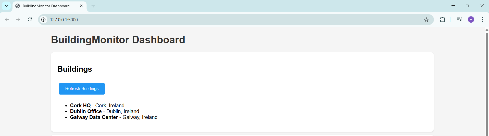
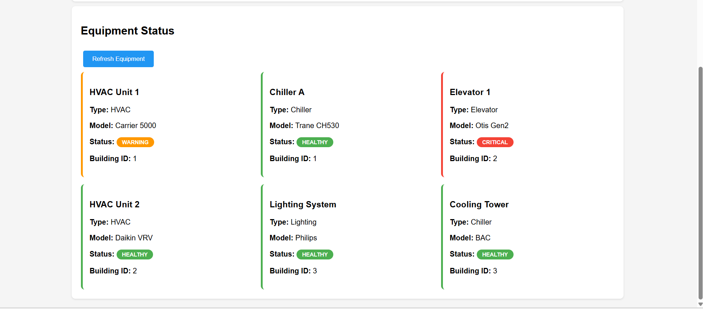

# BuildingMonitor

Small Flask and MySQL project I built while revising backend basics and trying to get closer to the kind of “equipment + telemetry” problems you see in building automation (similar space to Acuity / Atrius).

It’s intentionally concept similar to product full product.

## What it does

- Register buildings and equipment (HVAC, chillers, elevators, lighting)
- Accept sensor readings (temperature, vibration, runtime hours)
- Flag anomalies using a simple stats baseline
- Auto-updates equipment status: healthy → warning → critical
- Basic PyTest coverage for core endpoints

## Stack

- Python and Flask
- MySQL and SQLAlchemy
- PyTest
- requests (for seeding and sensor simulator)

## Run locally

1) Create `.env` in the project root:

## Screenshots

## Screenshots

### Dashboard View

git add README.md
### Equipment Status Monitoring

